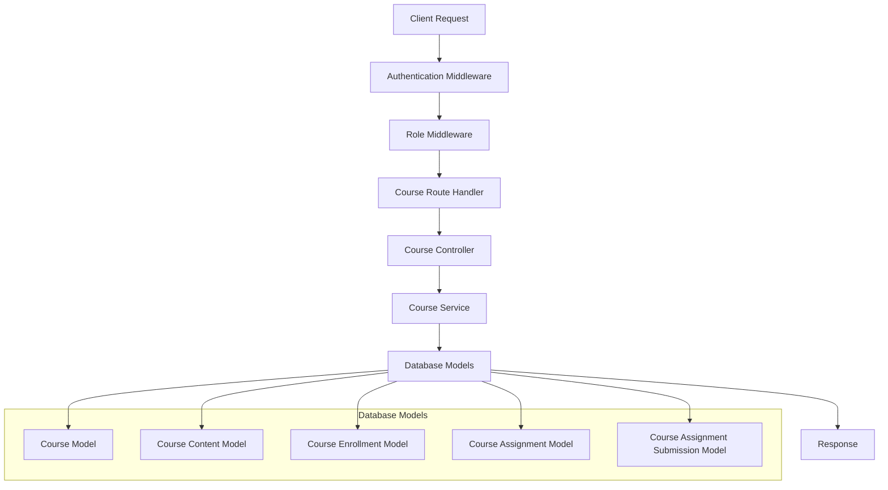
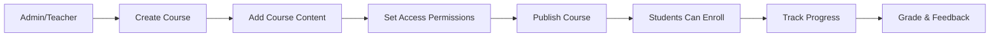
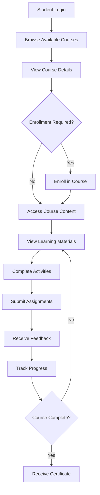
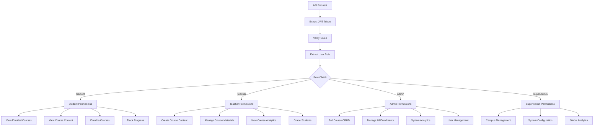
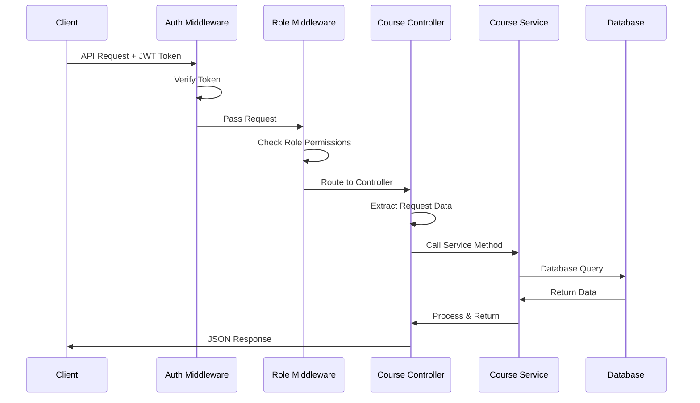
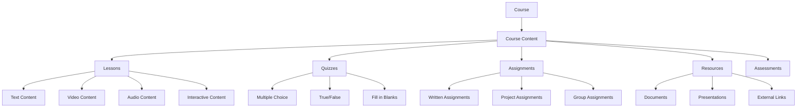
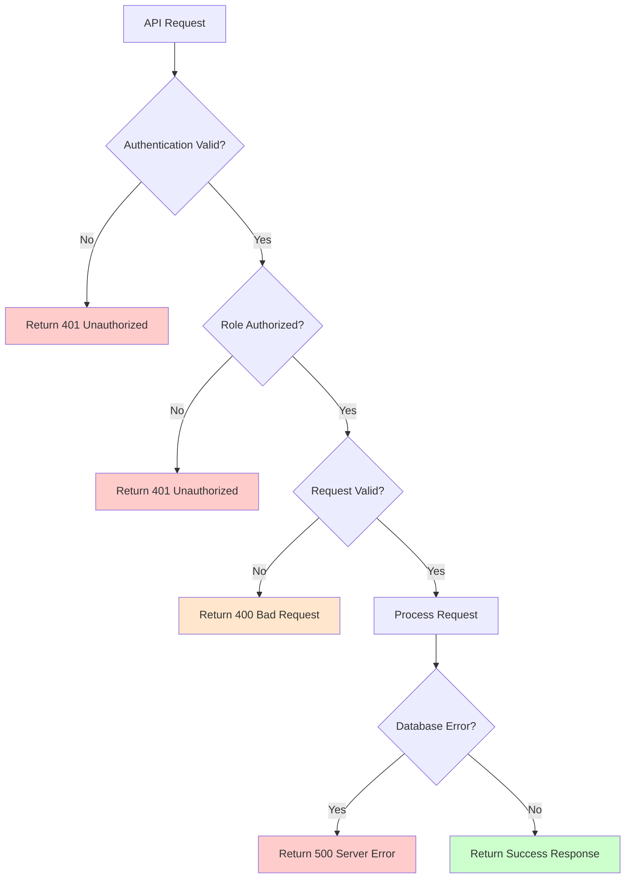

# Course API Flow Diagram

## High-Level Architecture Flow



## Course Management Flow



## Student Course Journey



## API Endpoint Relationships

```mermaid
graph TB
    subgraph "Course Management"
        A[POST /api/course/]
        B[GET /api/course/]
        C[GET /api/course/{id}]
        D[PUT /api/course/{id}]
        E[DELETE /api/course/{id}]
    end
    
    subgraph "Content Management"
        F[POST /api/course/{id}/content]
        G[GET /api/course/{id}/content]
        H[GET /api/course/{id}/content/{content_id}]
        I[PUT /api/course/{id}/content/{content_id}]
        J[DELETE /api/course/{id}/content/{content_id}]
    end
    
    subgraph "Enrollment Management"
        K[POST /api/course/{id}/enroll]
        L[GET /api/course/{id}/enrollment]
        M[GET /api/course/{id}/enrollment/{enrollment_id}]
        N[PUT /api/course/{id}/enrollment/{enrollment_id}]
        O[DELETE /api/course/{id}/enrollment/{enrollment_id}]
        P[GET /api/course/enrollment/user/{user_id}]
    end
    
    A --> F
    A --> K
    C --> G
    C --> L
```

## Role-Based Access Flow



## Data Flow Diagram



## Course Content Structure



## Error Handling Flow


