# SaaS Payment Gateway Flow Diagram - Complete Architecture

## System Architecture Overview

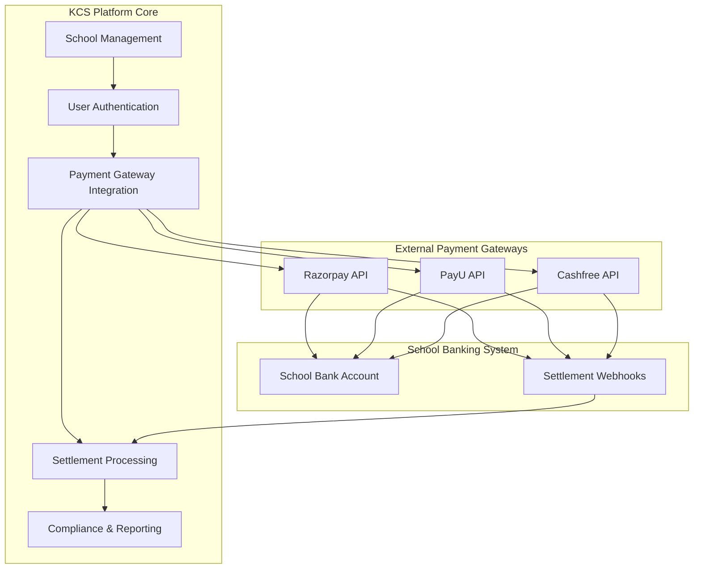

## Detailed Payment Flow

### 1. School Onboarding and Setup Flow

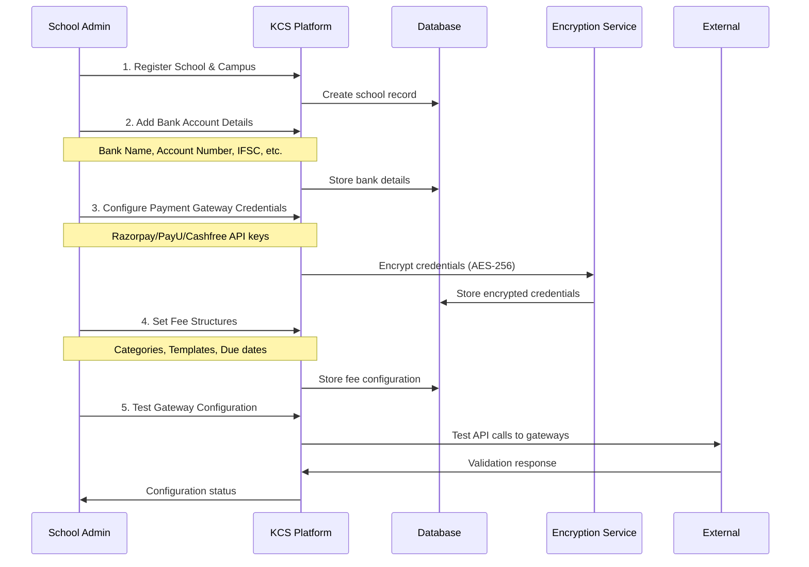

### 2. Fee Management and Generation Flow

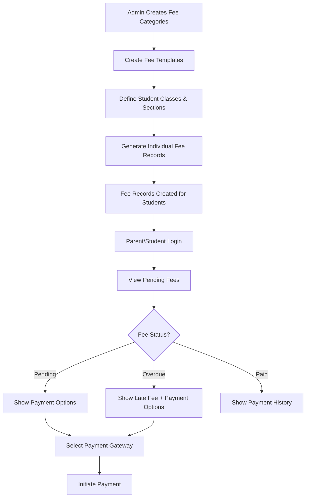

### 3. Complete Payment Processing Flow

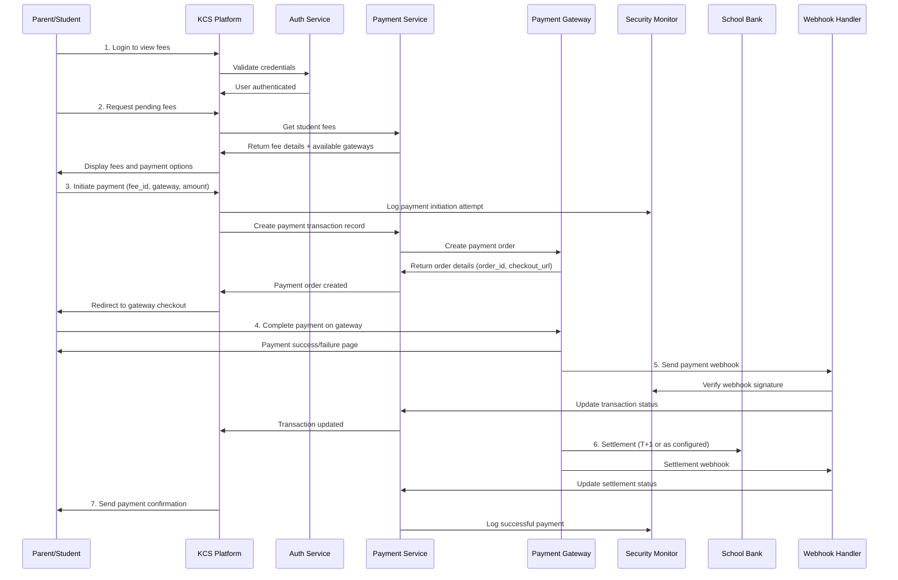

### 4. Security and Monitoring Flow

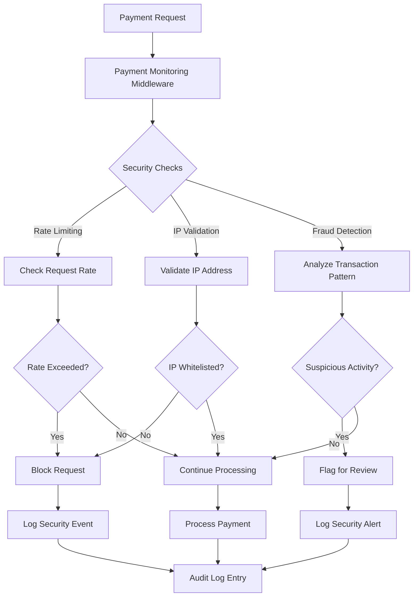

### 5. Settlement and Reconciliation Flow

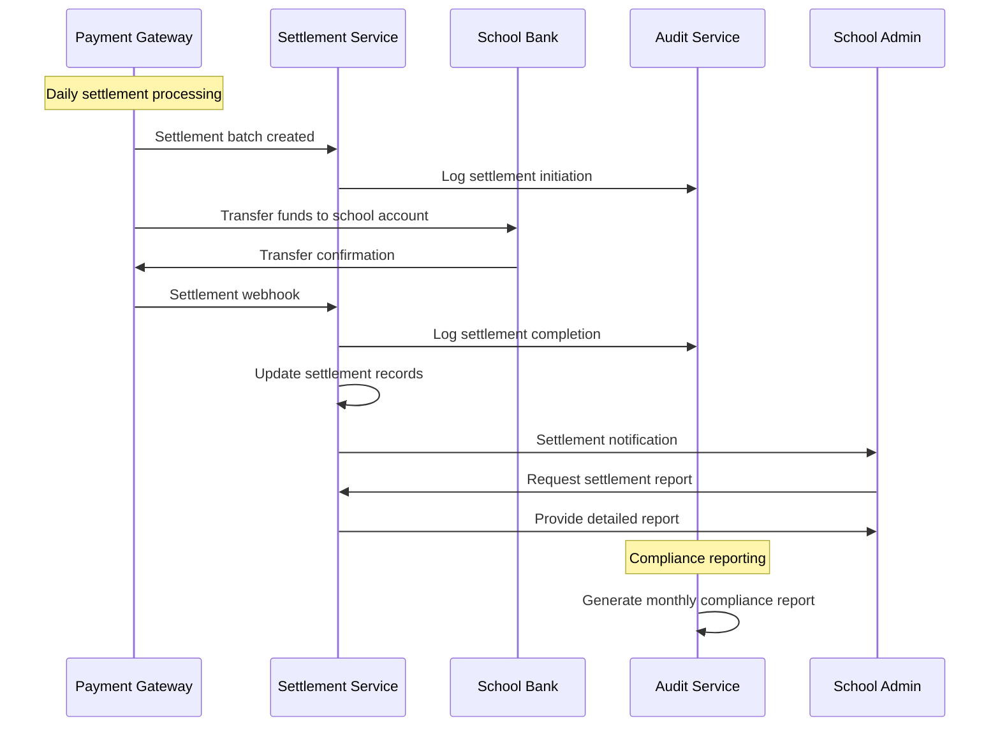

### 6. Error Handling and Recovery Flow

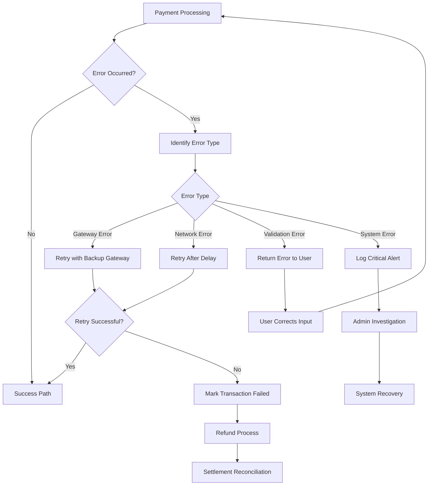

## Data Flow Diagrams

### 1. Credential Management Data Flow

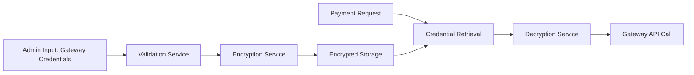

### 2. Transaction Lifecycle Data Flow

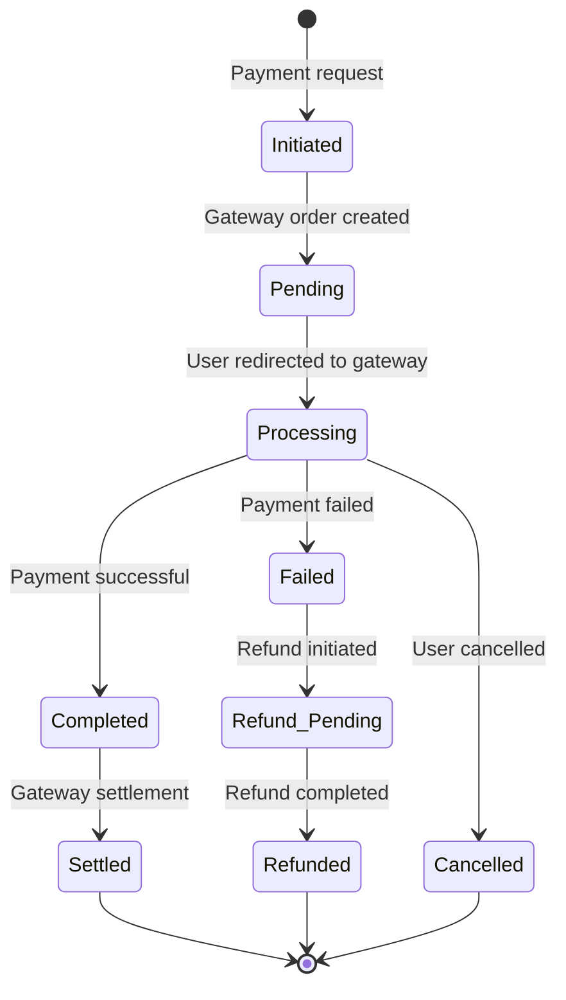

### 3. Security Event Flow

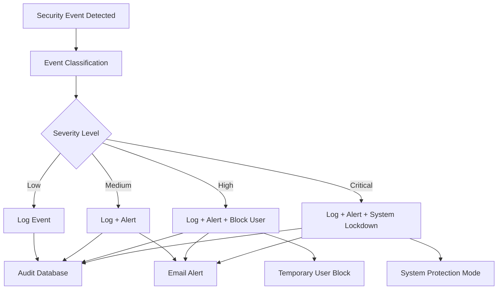

## API Flow Diagrams

### 1. Payment Initiation API Flow

```
POST /payment/initiate-payment

1. Request Validation
   ├── User Authentication Check
   ├── Fee ID Validation
   ├── Amount Validation
   └── Gateway Availability Check

2. Security Monitoring
   ├── Rate Limiting Check
   ├── IP Validation
   ├── Fraud Detection
   └── Audit Logging

3. Payment Processing
   ├── Create Transaction Record
   ├── Generate Gateway Order
   ├── Update Transaction with Order Details
   └── Return Checkout URL

4. Response Generation
   ├── Format Success Response
   ├── Include Payment Details
   └── Return to Client
```

### 2. Webhook Processing API Flow

```
POST /payment-settlement/webhook/:provider

1. Webhook Verification
   ├── Signature Validation
   ├── Provider Verification
   ├── Payload Structure Check
   └── Replay Attack Prevention

2. Transaction Processing
   ├── Find Transaction by Gateway Order ID
   ├── Validate Amount and Status
   ├── Update Transaction Status
   └── Generate Invoice (if payment successful)

3. Settlement Processing
   ├── Mark for Settlement Batch
   ├── Update Settlement Records
   ├── Log Settlement Event
   └── Trigger Notifications

4. Audit and Compliance
   ├── Security Event Logging
   ├── Audit Trail Update
   ├── Compliance Check
   └── Generate Response
```

## System Integration Points

### 1. External Gateway Integration

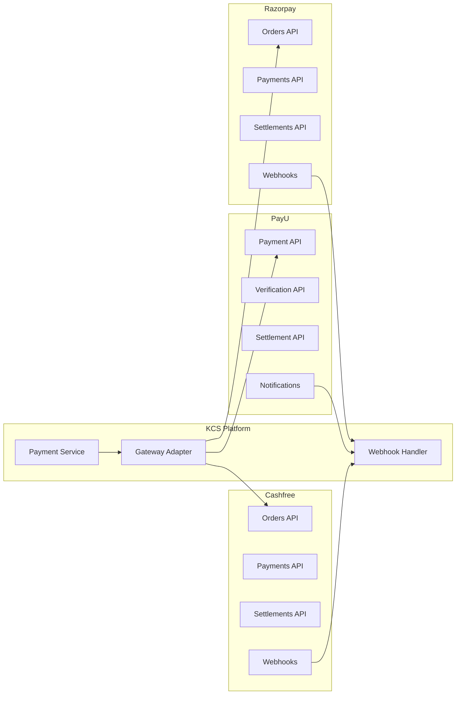

### 2. Internal Service Communication

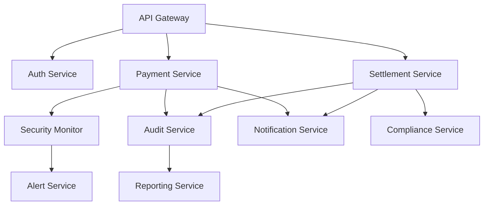

This comprehensive flow documentation provides a complete picture of how the SaaS payment gateway system operates, from school setup through payment processing to settlement and compliance reporting. The system is designed to be secure, scalable, and compliant with financial regulations while providing an excellent user experience for schools, parents, and students.
