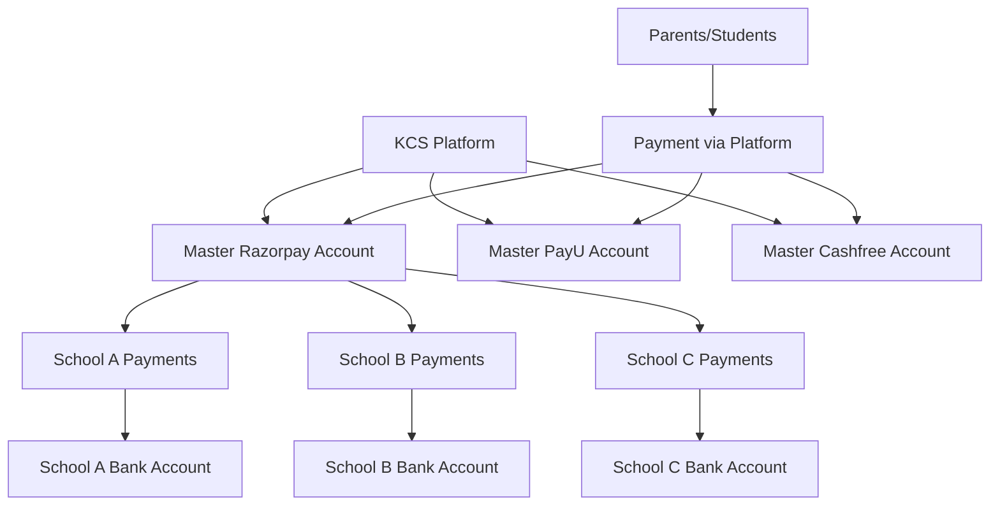
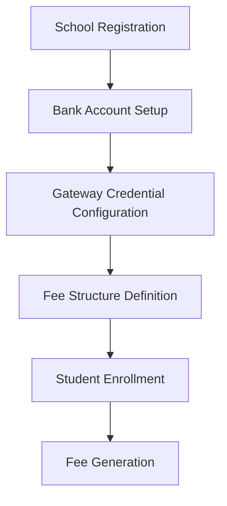
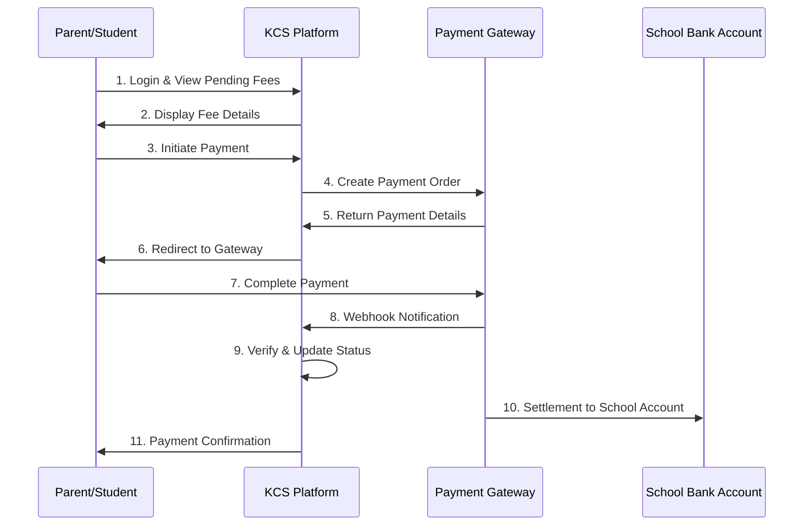
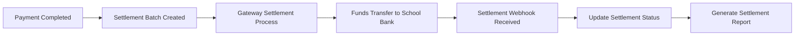

# SaaS Payment Gateway System - Comprehensive Flow Documentation

## Overview

The KCS Payment System is a comprehensive SaaS solution that facilitates secure payment processing between schools, parents (students), and multiple payment gateway providers. The system follows a clear separation of concerns where schools manage their bank accounts for receiving money and fee structures, while the platform handles payment gateway integration, security, and settlements.

## Key Stakeholders and Their Roles

### 1. **Schools (Educational Institutions)**
- **Primary Role**: Receive payments from parents/students
- **Responsibilities**:
  - Add and manage their bank account details for receiving settlements
  - Configure fee structures and categories
  - **Configure their own payment gateway credentials OR use platform-managed credentials**
  - Monitor payment collections and generate reports

### **Payment Gateway Credential Options:**

#### **Option A: Platform-Managed Credentials (Recommended for SaaS)**
- **Who owns**: KCS Platform (centralized master accounts)
- **Business Reality**: Payment gateways (Razorpay, PayU, Cashfree) require:
  - Legal business registration and documentation
  - Website domain verification and approval process
  - Bank account verification in business name
  - Compliance with KYC/regulatory requirements
  - Technical integration approval
- **Why schools can't provide credentials**:
  - Most schools don't have registered merchant accounts with gateways
  - Gateway approval process takes weeks/months for new businesses
  - Technical complexity of API integration
  - Compliance and security requirements
- **Platform approach**:
  - KCS Platform maintains master merchant accounts with all gateways
  - Single integration point for all schools
  - Platform handles compliance, security, and technical aspects
  - Settlements routed to individual school bank accounts

#### **Option B: School-Owned Credentials (Limited Use Cases)**
- **Who owns**: Individual schools (only for large institutions)
- **Realistic scenarios**: 
  - Large school chains with existing merchant accounts
  - International schools with specific gateway requirements
  - Schools with special compliance needs
- **Requirements**: 
  - School must already have approved merchant accounts
  - Technical team to manage API integrations
  - Separate compliance and security management
- **API endpoint**: `POST /payment/secure-credentials` (for enterprise clients)

#### **Recommended Business Model: Platform-Managed Approach**



### 2. **Parents/Students**
- **Primary Role**: Pay fees to schools
- **Responsibilities**:
  - View pending fees and payment history
  - Initiate payments through available gateways
  - Download payment receipts and invoices

### 3. **Payment Gateway Providers**
- **Supported Gateways**: Razorpay, PayU, Cashfree
- **Role**: Process payments and handle settlements to school bank accounts

## Complete Payment Flow Architecture

### Phase 1: School Setup and Configuration



#### 1.1 Bank Account Registration
```typescript
// API Endpoint: POST /payment/school-bank-details
// Only Admin/Super Admin can configure

{
  "bank_name": "State Bank of India",
  "account_number": "1234567890",
  "account_holder_name": "ABC School Trust",
  "ifsc_code": "SBIN0001234",
  "branch_name": "Main Branch",
  "account_type": "current",
  "upi_id": "school@paytm"
}
```

#### 1.2 Gateway Credentials Configuration
```typescript
// API Endpoint: POST /payment/secure-credentials
// Encrypted storage with AES-256

{
  "gateway": "razorpay",
  "credentials": {
    "key_id": "rzp_test_xxxxx",
    "key_secret": "xxxxx",
    "webhook_secret": "xxxxx"
  },
  "enabled": true
}
```

#### 1.3 Fee Structure Setup
```typescript
// API Endpoint: POST /payment/fee-categories

{
  "category_name": "Tuition Fee",
  "category_code": "TUITION_001",
  "description": "Monthly tuition fee",
  "is_mandatory": true,
  "due_frequency": "monthly"
}
```

### Phase 2: Payment Processing Flow



#### 2.1 Fee Viewing and Payment Initiation
```typescript
// API: GET /payment/student-fees
// Response includes pending fees with payment options

{
  "success": true,
  "data": {
    "pending_fees": [
      {
        "id": "fee_123",
        "category": "Tuition Fee",
        "amount": 5000,
        "due_date": "2024-01-31",
        "late_fee": 100,
        "total_amount": 5100
      }
    ],
    "available_gateways": ["razorpay", "payu", "cashfree"]
  }
}
```

#### 2.2 Payment Initiation Process
```typescript
// API: POST /payment/initiate-payment

// Request
{
  "fee_id": "fee_123",
  "student_id": "student_456",
  "gateway": "razorpay",
  "amount": 5100,
  "callback_url": "https://school.com/payment/success",
  "cancel_url": "https://school.com/payment/cancel"
}

// Response
{
  "success": true,
  "data": {
    "transaction": {
      "id": "txn_789",
      "gateway_order_id": "order_xyz123",
      "amount": 5100,
      "currency": "INR",
      "status": "pending"
    },
    "payment_details": {
      "checkout_url": "https://razorpay.com/checkout/...",
      "gateway_order_id": "order_xyz123"
    }
  }
}
```

### Phase 3: Security and Monitoring

#### 3.1 Payment Security Middleware
```typescript
// Automatic security monitoring for all payment operations
export const paymentMonitoringMiddleware = () => {
  return async (ctx: Context, next: Next) => {
    const requestContext = {
      request_id: crypto.randomUUID(),
      start_time: Date.now(),
      user_id: ctx.get("user_id"),
      campus_id: ctx.get("campus_id"),
      ip_address: getClientIP(ctx),
      endpoint: ctx.req.path,
      method: ctx.req.method
    };

    // Rate limiting, fraud detection, audit logging
    await securityChecks(requestContext);
    await next();
    await logAuditEvent(requestContext);
  };
};
```

#### 3.2 Credential Encryption
```typescript
// All gateway credentials are encrypted at rest
export class SecurePaymentCredentialService {
  static async storeSecureCredentials(
    campus_id: string,
    credentials: PaymentGatewayCredentials
  ): Promise<ISchoolBankDetails> {
    // AES-256 encryption
    const encryptedCredentials = CredentialEncryptionService.encryptCredentials(credentials);
    
    // Store in database with encrypted format
    return await SchoolBankDetails.updateById(campus_id, {
      encrypted_payment_credentials: encryptedCredentials,
      credential_updated_at: new Date()
    });
  }
}
```

### Phase 4: Settlement and Reconciliation

#### 4.1 Automatic Settlement Processing
```typescript
// API: POST /payment-settlement/manual (for manual triggers)
// Automatic settlements happen based on gateway schedules

{
  "gateway_provider": "razorpay",
  "settlement_date": "2024-01-31",
  "transaction_ids": ["txn_789", "txn_790"]
}
```

#### 4.2 Settlement Flow


### Phase 5: Compliance and Reporting

#### 5.1 Audit Logging
```typescript
// Every payment action is logged for compliance
interface PaymentAuditLog {
  id: string;
  campus_id: string;
  user_id: string;
  action: string; // 'payment_initiated', 'payment_completed', 'settlement_processed'
  entity_type: string; // 'transaction', 'settlement', 'configuration'
  entity_id: string;
  details: Record<string, any>;
  ip_address: string;
  user_agent: string;
  timestamp: Date;
}
```

#### 5.2 Compliance Reporting
```typescript
// API: GET /payment-settlement/compliance/report
{
  "start_date": "2024-01-01",
  "end_date": "2024-01-31",
  "report_type": "monthly"
}

// Response includes:
// - Total settlements processed
// - Transaction reconciliation
// - Security incidents
// - Audit trail summary
```

## Enhanced Security Features

### 1. **Multi-Layer Security**
```typescript
interface SecurityConfiguration {
  encryption_enabled: boolean;
  webhook_signature_verification: boolean;
  ip_whitelist: string[];
  allowed_payment_methods: string[];
  fraud_detection_enabled: boolean;
  daily_transaction_limit: number;
  monthly_transaction_limit: number;
}
```

### 2. **Real-time Monitoring**
```typescript
// Security events are logged and monitored
enum PaymentSecurityEventType {
  SUSPICIOUS_TRANSACTION = 'suspicious_transaction',
  MULTIPLE_FAILED_ATTEMPTS = 'multiple_failed_attempts',
  WEBHOOK_VERIFICATION_FAILED = 'webhook_verification_failed',
  API_KEY_EXPOSED = 'api_key_exposed'
}
```

### 3. **Gateway Configuration Management**
```typescript
interface PaymentGatewayConfiguration {
  gateway_provider: 'razorpay' | 'payu' | 'cashfree';
  is_primary: boolean;
  gateway_mode: 'test' | 'live';
  
  // Encrypted credentials
  api_key_encrypted: string;
  api_secret_encrypted: string;
  webhook_secret_encrypted: string;
  
  // Fee structure
  fee_structure: {
    transaction_fee_percentage: number;
    settlement_fee_percentage: number;
    fee_bearer: 'school' | 'student' | 'split';
  };
  
  // Security settings
  security_configuration: SecurityConfiguration;
}
```

## API Endpoints Summary

### School Management
- `POST /payment/school-bank-details` - Add/update bank account
- `GET /payment/school-bank-details` - View bank details
- `POST /payment/secure-credentials` - Configure gateway credentials
- `GET /payment/credentials/masked` - View masked credentials

### Fee Management
- `POST /payment/fee-categories` - Create fee categories
- `POST /payment/fee-templates` - Create fee templates
- `POST /payment/generate-fees` - Generate fees from templates

### Payment Processing
- `GET /payment/student-fees` - View pending fees
- `GET /payment/available-gateways` - Get available payment gateways
- `POST /payment/initiate-payment` - Start payment process
- `POST /payment/verify-payment` - Verify payment completion

### Settlement Management
- `POST /payment-settlement/manual` - Trigger manual settlement
- `GET /payment-settlement/status` - Check settlement status
- `POST /payment-settlement/webhook/:provider` - Handle gateway webhooks

### Compliance and Reporting
- `GET /payment-settlement/compliance/report` - Generate compliance reports
- `GET /payment-settlement/security/audit` - Access audit logs

## Best Practices for Implementation

### 1. **School Onboarding**
1. Register school and create campus
2. Set up bank account details first
3. Configure primary payment gateway
4. Test payment flow with small amounts
5. Set up fee structures and categories
6. Enable automatic settlements

### 2. **Parent/Student Experience**
1. Simple fee viewing interface
2. Multiple payment options
3. Clear payment status updates
4. Instant payment confirmations
5. Easy access to payment history

### 3. **Security Implementation**
1. All credentials encrypted at rest
2. Webhook signature verification
3. Real-time fraud detection
4. Comprehensive audit logging
5. Regular security assessments

### 4. **Settlement Management**
1. Automatic daily settlements
2. Real-time settlement tracking
3. Automated reconciliation
4. Settlement failure alerts
5. Detailed settlement reports

## Conclusion

This SaaS payment system provides a comprehensive solution for educational institutions to collect fees securely while maintaining compliance and providing excellent user experience. The system handles the complexity of multiple payment gateways while allowing schools to focus on their core educational activities.

The architecture supports scalability, security, and compliance requirements while providing detailed monitoring and reporting capabilities essential for financial operations in educational institutions.
