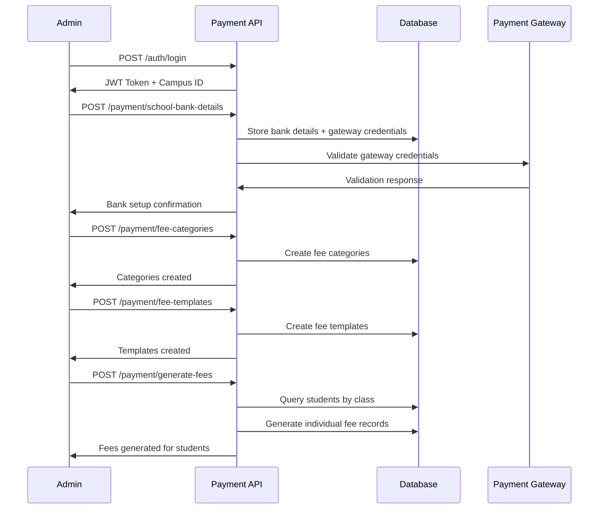
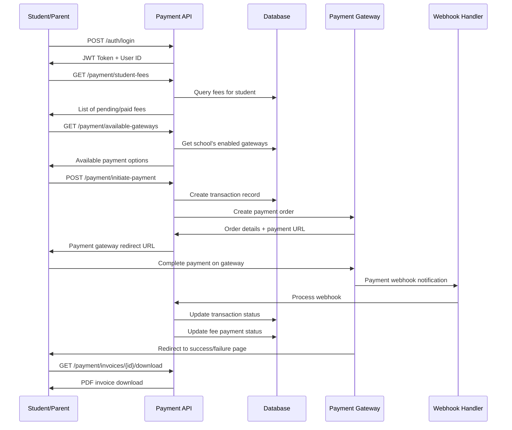
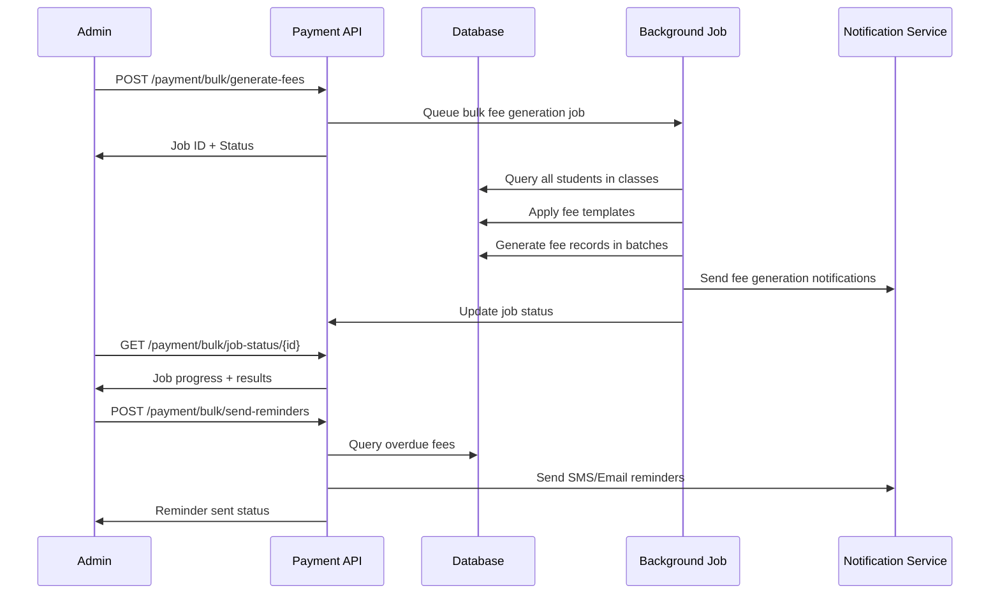

# SaaS Payment System Documentation

## Overview

This payment system is designed for a multi-tenant SaaS school platform where each school can:

1. **Manage their own bank account details** - Schools provide their banking information
2. **Configure fee structures** - Create categories and templates for different fees  
3. **Collect payments via multiple gateways** - Razorpay, PayU, and Cashfree support
4. **Maintain campus isolation** - Each school's data is completely isolated
5. **No SaaS platform charges** - All payments go directly to the school's account

## Architecture

### Key Principles

- **Campus Isolation**: Every operation is scoped to the user's campus using `campus_id`
- **Role-Based Access**: Admin, Student, Parent, and Teacher roles with appropriate permissions
- **Flexible Fee Structure**: Support for categories, templates, installments, and late fees
- **Multiple Payment Gateways**: Integration with popular Indian payment gateways
- **Complete Payment Lifecycle**: From fee generation to invoice creation

### Database Models

#### 1. School Bank Details (`school_bank_details`)
```typescript
{
  campus_id: string;           // Links to specific school
  bank_name: string;
  account_number: string;
  account_holder_name: string;
  ifsc_code: string;
  branch_name: string;
  account_type: "savings" | "current";
  upi_id?: string;
  payment_gateway_credentials: {
    razorpay?: { key_id, key_secret, webhook_secret, enabled };
    payu?: { merchant_key, merchant_salt, enabled };
    cashfree?: { app_id, secret_key, enabled };
  };
  is_active: boolean;
  is_verified: boolean;
}
```

#### 2. Fee Categories (`fee_categories`)
```typescript
{
  campus_id: string;
  name: string;               // "Tuition Fee", "Transport Fee", etc.
  description: string;
  is_mandatory: boolean;
  late_fee_applicable: boolean;
  late_fee_amount: number;
  is_active: boolean;
}
```

#### 3. Fee Templates (`fee_templates`)
```typescript
{
  campus_id: string;
  name: string;
  description: string;
  class_id?: string;          // Optional: specific to a class
  academic_year: string;
  items: Array<{
    category_id: string;
    amount: number;
    due_date: Date;
    is_mandatory: boolean;
    late_fee_applicable: boolean;
  }>;
  total_amount: number;
  installments_allowed: boolean;
  installment_config?: {
    max_installments: number;
    min_amount_per_installment: number;
  };
  is_active: boolean;
}
```

#### 4. Enhanced Fee Model (`fees`)
```typescript
{
  campus_id: string;
  user_id: string;            // Student ID
  parent_id?: string;
  class_id: string;
  academic_year: string;
  fee_template_id?: string;   // Reference to template used
  items: Array<{
    category_id: string;
    fee_type: string;
    amount: number;
    name: string;
    due_date: Date;
    is_mandatory: boolean;
    late_fee_applicable: boolean;
  }>;
  total_amount: number;
  paid_amount: number;
  due_amount: number;
  discount_amount: number;
  late_fee_amount: number;
  payment_status: "unpaid" | "partial" | "paid" | "overdue";
  installments_allowed: boolean;
  installment_plan?: {
    total_installments: number;
    completed_installments: number;
    next_due_date: Date;
    installment_amount: number;
  };
  auto_late_fee: boolean;
  reminder_sent: {
    email_count: number;
    sms_count: number;
    last_sent_at?: Date;
  };
}
```

#### 5. Payment Transactions (`payment_transactions`)
```typescript
{
  campus_id: string;
  transaction_id: string;
  fee_id: string;
  student_id: string;
  parent_id?: string;
  gateway: "razorpay" | "payu" | "cashfree";
  gateway_transaction_id?: string;
  amount: number;
  currency: string;
  status: "initiated" | "pending" | "completed" | "failed" | "cancelled";
  payment_method?: string;
  gateway_response?: object;
  callback_url?: string;
  cancel_url?: string;
  created_at: Date;
  completed_at?: Date;
}
```

#### 6. Payment Invoices (`payment_invoices`)
```typescript
{
  campus_id: string;
  invoice_number: string;
  transaction_id: string;
  fee_id: string;
  student_id: string;
  amount: number;
  tax_amount: number;
  total_amount: number;
  invoice_data: {
    school_details: object;
    student_details: object;
    fee_breakdown: object;
    payment_details: object;
  };
  status: "draft" | "sent" | "paid" | "cancelled";
  generated_at: Date;
  sent_at?: Date;
  pdf_url?: string;
}
```

## API Endpoints

### School Bank Details Management (Admin Only)

#### POST `/payment/school-bank-details`
Create or update school bank account details.

```json
{
  "bank_name": "State Bank of India",
  "account_number": "1234567890123456",
  "account_holder_name": "ABC School Trust",
  "ifsc_code": "SBIN0001234",
  "branch_name": "Education City Branch",
  "account_type": "current",
  "upi_id": "school@paytm",
  "payment_gateway_credentials": {
    "razorpay": {
      "key_id": "rzp_test_1234567890",
      "key_secret": "your_secret",
      "webhook_secret": "webhook_secret",
      "enabled": true
    }
  }
}
```

#### GET `/payment/school-bank-details`
Retrieve current school bank account details.

### Fee Categories Management (Admin Only)

#### POST `/payment/fee-categories`
Create a new fee category.

```json
{
  "name": "Tuition Fee",
  "description": "Monthly tuition fee for academic courses",
  "is_mandatory": true,
  "late_fee_applicable": true,
  "late_fee_amount": 50
}
```

#### GET `/payment/fee-categories`
Get all fee categories for the school.

#### PUT `/payment/fee-categories/:id`
Update an existing fee category.

### Fee Templates Management (Admin Only)

#### POST `/payment/fee-templates`
Create a fee template for specific class/academic year.

```json
{
  "name": "Grade 10 Monthly Fee Template",
  "description": "Monthly fee structure for Grade 10 students",
  "class_id": "class_grade_10",
  "academic_year": "2023-24",
  "items": [
    {
      "category_id": "tuition_category_id",
      "amount": 5000,
      "due_date": "2023-12-05T00:00:00Z",
      "is_mandatory": true,
      "late_fee_applicable": true
    }
  ],
  "total_amount": 5000,
  "installments_allowed": true,
  "installment_config": {
    "max_installments": 3,
    "min_amount_per_installment": 1500
  }
}
```

#### GET `/payment/fee-templates?class_id=xxx&academic_year=xxx`
Get fee templates with optional filtering.

### Fee Generation (Admin Only)

#### POST `/payment/generate-fees`
Generate individual fee records for students based on template.

```json
{
  "template_id": "template_123",
  "academic_year": "2023-24",
  "class_id": "class_123",
  "student_ids": ["student_1", "student_2"],
  "apply_discounts": true,
  "installments_allowed": true
}
```

### Payment Processing (Students/Parents)

#### POST `/payment/initiate-payment`
Start payment process for a fee.

```json
{
  "fee_id": "fee_123",
  "gateway": "razorpay",
  "amount": 5000,
  "callback_url": "https://your-app.com/payment/callback",
  "cancel_url": "https://your-app.com/payment/cancel"
}
```

#### POST `/payment/verify-payment/:transaction_id`
Verify payment completion and update records.

```json
{
  "payment_id": "pay_123456789",
  "signature": "signature_hash",
  "status": "completed"
}
```

### Information Retrieval

#### GET `/payment/student-fees?student_id=xxx&status=xxx`
Get pending and paid fees for a student.

#### GET `/payment/payment-history?student_id=xxx&status=xxx`
Get payment history for student/parent.

#### GET `/payment/available-gateways`
Get list of available payment gateways for the school.

#### GET `/payment/invoices/:invoice_id/download`
Download payment invoice as PDF.

## API Flow Diagrams

### 1. Complete School Setup Flow (Admin)



### 2. Student Fee Payment Flow



### 3. Bulk Operations Flow (Admin)



## Detailed Payment Flows

### 1. End-to-End Payment Process

```
┌─────────────────┐    ┌──────────────────┐    ┌─────────────────┐
│   Student/      │    │   School SaaS    │    │   Payment       │
│   Parent App    │    │   Platform       │    │   Gateway       │
└─────────────────┘    └──────────────────┘    └─────────────────┘
         │                       │                       │
         │ 1. Login              │                       │
         ├──────────────────────►│                       │
         │ ◄─────────────────────┤ JWT + Campus Context  │
         │                       │                       │
         │ 2. Get Pending Fees   │                       │
         ├──────────────────────►│                       │
         │ ◄─────────────────────┤ Fee List with Details │
         │                       │                       │
         │ 3. Select Fee & Gateway│                      │
         ├──────────────────────►│                       │
         │                       │ 4. Create Transaction │
         │                       ├──────────────────────►│
         │                       │ ◄─────────────────────┤ Order ID
         │ ◄─────────────────────┤ Payment URL           │
         │                       │                       │
         │ 5. Redirect to Gateway│                       │
         ├─────────────────────────────────────────────►│
         │                       │                       │
         │ 6. Complete Payment   │                       │
         ├─────────────────────────────────────────────►│
         │                       │ 7. Webhook Notification│
         │                       │ ◄─────────────────────┤
         │                       │ 8. Verify & Update   │
         │                       │   Transaction Status │
         │ ◄─────────────────────┤                       │
         │ 9. Success/Failure    │                       │
         │    Redirect           │                       │
         │                       │                       │
         │ 10. Download Invoice  │                       │
         ├──────────────────────►│                       │
         │ ◄─────────────────────┤ PDF Invoice           │
```

### 2. Payment Gateway Integration Flow

#### Razorpay Flow
```
1. Order Creation:
   POST /payment/initiate-payment
   ↓
   Create Razorpay Order
   ↓
   Return checkout URL

2. Payment Processing:
   User pays on Razorpay
   ↓
   Razorpay webhook triggered
   ↓
   Verify payment signature
   ↓
   Update transaction status

3. Verification Steps:
   - Verify webhook signature using secret
   - Match order_id with our transaction_id
   - Update payment status in database
   - Generate invoice if successful
```

#### PayU Flow
```
1. Hash Generation:
   Calculate SHA512 hash of payment parameters
   ↓
   Redirect user to PayU with hash

2. Payment Response:
   PayU sends response to success/failure URL
   ↓
   Verify response hash
   ↓
   Update transaction status

3. Verification Steps:
   - Recalculate hash with response parameters
   - Compare with received hash
   - Validate transaction amount
   - Update payment status
```

#### Cashfree Flow
```
1. Session Creation:
   Create payment session with Cashfree
   ↓
   Get session_id and payment_url

2. Payment Processing:
   User completes payment
   ↓
   Cashfree webhook notification
   ↓
   Verify webhook signature

3. Verification Steps:
   - Verify webhook timestamp and signature
   - Check payment status via Cashfree API
   - Update transaction in database
   - Handle payment success/failure
```

### 3. Campus Isolation in Payment Flow

```
Every API Request:
┌─────────────────┐
│ JWT Token       │
│ Contains:       │
│ - user_id       │
│ - campus_id     │
│ - role          │
└─────────────────┘
         │
         ▼
┌─────────────────┐
│ Auth Middleware │
│ Extracts:       │
│ - campus_id     │
│ - user context  │
└─────────────────┘
         │
         ▼
┌─────────────────┐
│ All DB Queries  │
│ Include:        │
│ - campus_id     │
│ - role checks   │
└─────────────────┘

Example Query:
fees = await Fee.find({
  campus_id: ctx.campus_id,
  user_id: student_id,
  payment_status: 'pending'
});
```

### 4. Error Handling Flow

```
Payment Initiation Error:
User Request → Validation Error → Return 400 with error details

Gateway Communication Error:
API → Gateway → Timeout/Error → Log Error → Return 503 → Retry Logic

Payment Verification Error:
Webhook → Signature Verification Failed → Log Security Alert → Return 401

Database Error:
Any Operation → DB Error → Log Error → Return 500 → Cleanup Transaction

Campus Isolation Error:
Request → Campus Mismatch → Log Security Alert → Return 403 → Block Request
```

### 5. Webhook Processing Flow

```
┌─────────────────┐    ┌──────────────────┐    ┌─────────────────┐
│   Payment       │    │   Webhook        │    │   Database      │
│   Gateway       │    │   Handler        │    │   Updates       │
└─────────────────┘    └──────────────────┘    └─────────────────┘
         │                       │                       │
         │ Payment Completed     │                       │
         ├──────────────────────►│                       │
         │                       │ 1. Verify Signature  │
         │                       │ 2. Extract Payment ID│
         │                       │ 3. Find Transaction  │
         │                       ├──────────────────────►│
         │                       │ ◄─────────────────────┤
         │                       │ 4. Update Status     │
         │                       ├──────────────────────►│
         │                       │ 5. Update Fee Record │
         │                       ├──────────────────────►│
         │                       │ 6. Generate Invoice  │
         │                       ├──────────────────────►│
         │                       │ 7. Send Notifications│
         │                       │                       │
         │ ◄─────────────────────┤ 200 OK Response      │
```

### 6. Notification Flow Integration

```
Payment Events → Notification Triggers:

Fee Generated:
├── Email: Fee generated notification to parent
└── SMS: Fee due reminder

Payment Due (3 days before):
├── Email: Payment reminder with fee details
└── SMS: Payment due reminder

Payment Overdue:
├── Email: Overdue notice with late fee details
├── SMS: Urgent payment reminder
└── Admin Alert: Overdue payment notification

Payment Successful:
├── Email: Payment confirmation with receipt
├── SMS: Payment success message
└── Invoice Generation: PDF receipt

Payment Failed:
├── Email: Payment failure notification
├── SMS: Payment retry reminder
└── Admin Alert: Failed payment notification
```

## User Flows

### 1. School Admin Setup Flow

1. **Login as Admin**: Authenticate with admin credentials
2. **Setup Bank Details**: Configure school's bank account and payment gateway credentials
3. **Create Fee Categories**: Define different types of fees (Tuition, Transport, etc.)
4. **Create Fee Templates**: Set up fee structures for different classes/years
5. **Generate Fees**: Create individual fee records for students based on templates

### 2. Student/Parent Payment Flow

1. **Login**: Authenticate as student or parent
2. **View Fees**: See pending, paid, and overdue fees
3. **Select Payment Gateway**: Choose from available payment options
4. **Initiate Payment**: Start payment process and get redirected to gateway
5. **Complete Payment**: Make payment through the chosen gateway
6. **Get Invoice**: Receive payment confirmation and invoice
7. **View History**: Access payment history and download receipts

### 3. Campus Isolation Implementation

Every API call automatically includes campus isolation:

```typescript
// In middleware
const campus_id = ctx.get("campus_id"); // Extracted from user context

// In services
const fees = await Fee.find({ campus_id, user_id });
const bankDetails = await SchoolBankDetails.find({ campus_id });
```

## API Endpoint Detailed Flows

### 1. Payment Initiation Flow

```
POST /payment/initiate-payment
├── Request Validation
│   ├── Check fee_id exists
│   ├── Verify fee belongs to user's campus
│   ├── Validate amount against fee due_amount
│   └── Check gateway is enabled for school
├── Gateway-Specific Processing
│   ├── Razorpay: Create order with amount in paise
│   ├── PayU: Generate hash with merchant credentials
│   └── Cashfree: Create payment session
├── Transaction Creation
│   ├── Generate unique transaction_id
│   ├── Store transaction with 'initiated' status
│   └── Set callback and cancel URLs
└── Response
    ├── Return payment URL for redirect
    ├── Include transaction_id for tracking
    └── Provide gateway-specific parameters
```

### 2. Payment Verification Flow

```
POST /payment/verify-payment/:transaction_id
├── Transaction Lookup
│   ├── Find transaction by ID and campus
│   ├── Verify transaction is in 'initiated' status
│   └── Check transaction hasn't expired
├── Gateway Verification
│   ├── Razorpay: Verify signature using webhook secret
│   ├── PayU: Recalculate and verify hash
│   └── Cashfree: Validate webhook signature and timestamp
├── Payment Status Update
│   ├── Update transaction status (completed/failed)
│   ├── Update fee payment status and amounts
│   ├── Calculate remaining due amount
│   └── Apply late fees if applicable
├── Post-Payment Processing
│   ├── Generate payment invoice
│   ├── Send payment confirmation notifications
│   ├── Update student payment history
│   └── Trigger analytics update
└── Response
    ├── Return updated payment status
    ├── Provide invoice download link
    └── Include updated fee details
```

### 3. Fee Generation Flow

```
POST /payment/generate-fees
├── Template Validation
│   ├── Verify template exists and belongs to campus
│   ├── Check template is active
│   └── Validate academic year and class
├── Student Processing
│   ├── Query students by class_id and campus_id
│   ├── Filter by provided student_ids (if any)
│   └── Verify students exist and are enrolled
├── Fee Creation Loop (for each student)
│   ├── Check if fee already exists for period
│   ├── Apply template to generate fee items
│   ├── Calculate total amount and due dates
│   ├── Apply any applicable discounts
│   └── Create fee record with 'unpaid' status
├── Bulk Processing Optimization
│   ├── Process in batches of 100 students
│   ├── Use database transactions for consistency
│   └── Implement retry logic for failures
└── Response
    ├── Return count of fees generated
    ├── List any failed student IDs
    └── Provide summary of total amounts
```

## State Management and Data Consistency

### 1. Payment Transaction States

```
Transaction State Machine:
┌─────────────┐    ┌─────────────┐    ┌─────────────┐
│  initiated  │───►│   pending   │───►│ completed   │
└─────────────┘    └─────────────┘    └─────────────┘
         │                │                   │
         │                │                   │
         ▼                ▼                   ▼
┌─────────────┐    ┌─────────────┐    ┌─────────────┐
│  cancelled  │    │   failed    │    │   refunded  │
└─────────────┘    └─────────────┘    └─────────────┘

State Transitions:
- initiated → pending: Gateway order created
- pending → completed: Payment successful
- pending → failed: Payment failed/declined
- initiated → cancelled: User cancelled before payment
- completed → refunded: Payment refunded (manual process)
```

### 2. Fee Payment Status Flow

```
Fee Status Progression:
┌─────────────┐    ┌─────────────┐    ┌─────────────┐
│   unpaid    │───►│   partial   │───►│    paid     │
└─────────────┘    └─────────────┘    └─────────────┘
         │                │                   
         │                │                   
         ▼                ▼                   
┌─────────────┐    ┌─────────────┐    
│   overdue   │───►│partial+late │    
└─────────────┘    └─────────────┘    

Status Logic:
- unpaid: due_amount = total_amount, paid_amount = 0
- partial: 0 < paid_amount < total_amount
- paid: paid_amount >= total_amount
- overdue: due_date passed and amount pending
```

### 3. Data Consistency Patterns

#### Transaction Management
```typescript
// Example: Payment completion with transaction
const session = await startTransaction();
try {
  // Update transaction status
  await updateTransaction(transaction_id, { 
    status: 'completed',
    gateway_response: payment_data 
  }, { session });
  
  // Update fee payment
  await updateFeePayment(fee_id, {
    paid_amount: fee.paid_amount + amount,
    payment_status: calculateStatus(fee)
  }, { session });
  
  // Generate invoice
  await generateInvoice({
    transaction_id,
    fee_id,
    amount
  }, { session });
  
  await session.commitTransaction();
} catch (error) {
  await session.abortTransaction();
  throw error;
}
```

#### Idempotency Handling
```typescript
// Webhook idempotency
const processWebhook = async (webhookData) => {
  const existingProcess = await WebhookLog.findOne({
    gateway_transaction_id: webhookData.payment_id,
    event_type: webhookData.event
  });
  
  if (existingProcess && existingProcess.processed) {
    return existingProcess.result; // Return cached result
  }
  
  // Process webhook
  const result = await processPaymentWebhook(webhookData);
  
  // Log processing
  await WebhookLog.create({
    gateway_transaction_id: webhookData.payment_id,
    event_type: webhookData.event,
    processed: true,
    result: result
  });
  
  return result;
};
```

## Payment Gateway Integration

### Razorpay Integration

```typescript
// Order creation
const order = await razorpay.orders.create({
  amount: amount * 100, // Convert to paise
  currency: 'INR',
  receipt: transaction_id,
  payment_capture: 1
});

// Payment verification
const signature = crypto
  .createHmac('sha256', webhook_secret)
  .update(order_id + "|" + payment_id)
  .digest('hex');
```

### PayU Integration

```typescript
// Hash generation for PayU
const hashString = `${key}|${transaction_id}|${amount}|${productinfo}|${firstname}|${email}|||||||||||${salt}`;
const hash = crypto.createHash('sha512').update(hashString).digest('hex');
```

### Cashfree Integration

```typescript
// Order creation with Cashfree
const order = {
  order_id: transaction_id,
  order_amount: amount,
  order_currency: 'INR',
  customer_details: {
    customer_id: student_id,
    customer_name: student_name,
    customer_email: student_email,
    customer_phone: student_phone
  }
};
```

## Security Features

1. **Campus Isolation**: Automatic data segregation by campus
2. **Role-based Access Control**: Different permissions for different user types
3. **Secure Gateway Integration**: Proper signature verification for all gateways
4. **Webhook Security**: Secure handling of payment gateway webhooks
5. **Data Encryption**: Sensitive payment gateway credentials are encrypted

## Best Practices

### For School Admins

1. **Test Gateway Credentials**: Always test payment gateway setup before going live
2. **Set Appropriate Due Dates**: Configure realistic due dates for fee payments
3. **Monitor Late Fees**: Regularly review late fee accumulation
4. **Backup Payment Data**: Maintain regular backups of payment transactions
5. **Review Fee Categories**: Periodically audit and update fee categories

### For Developers

1. **Error Handling**: Implement comprehensive error handling for payment failures
2. **Logging**: Log all payment transactions for audit purposes
3. **Webhook Reliability**: Ensure webhook endpoints are reliable and idempotent
4. **Testing**: Thoroughly test payment flows with all supported gateways
5. **Monitoring**: Monitor payment success rates and gateway performance

## Troubleshooting

### Common Issues

1. **Payment Gateway Errors**: Check gateway credentials and network connectivity
2. **Campus Isolation Issues**: Verify campus_id is properly set in context
3. **Fee Generation Failures**: Ensure class and student data exists
4. **Webhook Failures**: Check webhook URL accessibility and signature verification
5. **Invoice Generation Issues**: Verify PDF generation dependencies

### Error Codes

- `PAYMENT_001`: Invalid payment gateway credentials
- `PAYMENT_002`: Insufficient bank details
- `PAYMENT_003`: Fee template not found
- `PAYMENT_004`: Student not found in class
- `PAYMENT_005`: Payment gateway timeout
- `PAYMENT_006`: Invalid webhook signature

## Future Enhancements

1. **SMS/Email Notifications**: Automated payment reminders and confirmations
2. **Bulk Operations**: Bulk fee generation and payment processing
3. **Analytics Dashboard**: Payment analytics and reporting
4. **Mobile App Integration**: Native mobile payment interfaces
5. **Advanced Discounts**: Rule-based discount systems
6. **Recurring Payments**: Automatic recurring payment setup
7. **Multi-currency Support**: Support for international payments

## Support

For technical support or questions about the payment system:

1. Check the API documentation and test scripts
2. Review error logs for detailed error information
3. Test with sandbox/test credentials first
4. Contact your payment gateway support for gateway-specific issues
5. Refer to the troubleshooting section for common solutions

---

This payment system provides a complete, flexible, and secure solution for SaaS school platforms to manage fee collection while maintaining complete campus isolation and supporting multiple payment gateways.
