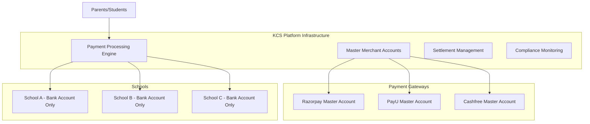

# Platform-Managed Payment Gateway Implementation

## Why Schools Can't Provide Their Own Gateway Credentials

### Payment Gateway Business Requirements

Payment gateway providers like Razorpay, PayU, and Cashfree have strict requirements for merchant account approval:

#### 1. **Legal Business Documentation**
```
Required Documents:
- Business Registration Certificate
- PAN Card / Tax Registration
- Bank Account in Business Name
- GST Registration (for Indian businesses)
- Director/Owner Identity Proof
- Address Proof of Business
```

#### 2. **Website Verification Process**
```
Gateway Requirements:
- Live website with business domain
- Terms & Conditions page
- Privacy Policy
- Refund/Cancellation Policy
- Contact Information
- Business Description
- SSL Certificate
```

#### 3. **Technical Integration Approval**
```
Technical Requirements:
- API integration testing
- Webhook implementation
- Security compliance check
- Transaction flow verification
- Error handling validation
```

#### 4. **Compliance and Risk Assessment**
```
Business Verification:
- Business model review
- Financial stability check
- Risk category assessment
- Transaction volume estimation
- Chargeback risk evaluation
```

### Why This Makes School-Owned Credentials Impractical

#### **1. Time and Complexity**
- Gateway approval process: 2-4 weeks minimum
- Documentation preparation: 1-2 weeks
- Technical integration setup: 1-2 weeks
- **Total onboarding time**: 4-8 weeks per school

#### **2. Technical Expertise Required**
- API integration knowledge
- Webhook handling implementation
- Security certificate management
- PCI compliance understanding
- Error handling and monitoring

#### **3. Compliance Burden**
- Individual KYC for each school
- Separate compliance monitoring
- Multiple point of failure for audits
- Regulatory reporting complexity

#### **4. Cost Implications**
- Individual merchant account fees
- Higher transaction rates (no volume negotiation)
- Separate compliance costs
- Technical support overhead

## Platform-Managed Credentials: The Practical Solution

### Business Model Architecture



### Implementation Details

#### **1. Platform Gateway Configuration**
```typescript
// Platform-level gateway credentials (encrypted in environment)
const PLATFORM_GATEWAY_CONFIG = {
  razorpay: {
    master_key_id: process.env.RAZORPAY_MASTER_KEY_ID,
    master_key_secret: process.env.RAZORPAY_MASTER_KEY_SECRET,
    webhook_secret: process.env.RAZORPAY_WEBHOOK_SECRET,
    account_id: process.env.RAZORPAY_PLATFORM_ACCOUNT_ID
  },
  payu: {
    master_merchant_key: process.env.PAYU_MASTER_MERCHANT_KEY,
    master_salt: process.env.PAYU_MASTER_SALT,
    platform_account_id: process.env.PAYU_PLATFORM_ACCOUNT_ID
  },
  cashfree: {
    master_app_id: process.env.CASHFREE_MASTER_APP_ID,
    master_secret_key: process.env.CASHFREE_MASTER_SECRET_KEY,
    platform_account_id: process.env.CASHFREE_PLATFORM_ACCOUNT_ID
  }
};
```

#### **2. School-Specific Payment Processing**
```typescript
// Payment initiation with school-specific routing
export class PlatformPaymentService {
  static async initiatePayment(
    campus_id: string,
    fee_id: string,
    student_id: string,
    amount: number,
    gateway: string
  ) {
    // Get school bank details for settlement routing
    const schoolBankDetails = await this.getSchoolBankDetails(campus_id);
    
    // Create payment order with platform credentials
    const orderRequest = {
      amount,
      currency: "INR",
      receipt: `${campus_id}_${fee_id}_${Date.now()}`,
      // School-specific metadata for settlement routing
      notes: {
        campus_id,
        school_bank_account: schoolBankDetails.account_number,
        school_ifsc: schoolBankDetails.ifsc_code,
        settlement_account: schoolBankDetails.account_holder_name
      }
    };

    // Use platform gateway credentials
    const gatewayConfig = PLATFORM_GATEWAY_CONFIG[gateway];
    const paymentOrder = await this.createGatewayOrder(gateway, gatewayConfig, orderRequest);
    
    return paymentOrder;
  }
}
```

#### **3. Automated Settlement Routing**
```typescript
// Settlement processing with school-specific routing
export class PlatformSettlementService {
  static async processSettlement(gatewayProvider: string, settlementData: any) {
    // Extract school information from payment metadata
    const transactions = await this.getTransactionsBySettlement(settlementData.settlement_id);
    
    // Group transactions by school
    const schoolGroupedTransactions = this.groupTransactionsBySchool(transactions);
    
    // Process settlement for each school separately
    for (const [campus_id, schoolTransactions] of schoolGroupedTransactions) {
      const schoolBankDetails = await this.getSchoolBankDetails(campus_id);
      
      const settlementAmount = schoolTransactions.reduce((sum, txn) => sum + txn.amount, 0);
      
      // Create settlement record for this school
      await this.createSchoolSettlement({
        campus_id,
        gateway_provider: gatewayProvider,
        transaction_ids: schoolTransactions.map(t => t.id),
        amount: settlementAmount,
        settlement_account: schoolBankDetails.account_number,
        settlement_ifsc: schoolBankDetails.ifsc_code,
        settlement_status: 'pending'
      });
      
      // Gateway will settle to school account based on routing rules
      await this.initiateGatewaySettlement(gatewayProvider, {
        amount: settlementAmount,
        account_number: schoolBankDetails.account_number,
        ifsc_code: schoolBankDetails.ifsc_code,
        beneficiary_name: schoolBankDetails.account_holder_name
      });
    }
  }
}
```

### School Onboarding Flow (Simplified)

#### **Step 1: School Registration**
```typescript
// Only bank account details required from school
{
  "school_name": "ABC International School",
  "bank_name": "State Bank of India",
  "account_number": "1234567890123456",
  "account_holder_name": "ABC International School Trust",
  "ifsc_code": "SBIN0001234",
  "branch_name": "Main Branch",
  "account_type": "current"
}
```

#### **Step 2: Platform Gateway Assignment**
```typescript
// Automatic gateway assignment by platform
{
  "campus_id": "school_abc_123",
  "assigned_gateways": {
    "primary": "razorpay",
    "secondary": "payu",
    "backup": "cashfree"
  },
  "platform_managed": true,
  "gateway_fees": {
    "transaction_fee": "2.0%",
    "settlement_fee": "₹5 per settlement",
    "platform_fee": "0.5%"
  }
}
```

#### **Step 3: Immediate Payment Activation**
- School can start accepting payments immediately
- No waiting for gateway approvals
- No technical integration required
- Platform handles all compliance

### Revenue Model for Platform

#### **Fee Structure**
```typescript
interface PlatformRevenueModel {
  gateway_transaction_fee: number; // 1.8-2.5% (paid to gateway)
  platform_service_fee: number;   // 0.5-1.0% (platform revenue)
  settlement_processing_fee: number; // ₹5-10 per settlement
  monthly_subscription: number;    // ₹500-2000 per school
  
  // Additional revenue streams
  advanced_analytics_fee: number; // ₹200-500/month
  custom_branding_fee: number;    // ₹1000-5000/month
  priority_support_fee: number;   // ₹500-2000/month
}
```

### Benefits of Platform-Managed Approach

#### **For Schools:**
1. **Instant Setup**: Start accepting payments immediately
2. **No Technical Complexity**: Just provide bank account details
3. **Better Rates**: Platform negotiates volume-based pricing
4. **Compliance Handled**: Platform manages all regulatory requirements
5. **24/7 Support**: Dedicated technical support team

#### **For Platform:**
1. **Scalable Business Model**: Onboard schools rapidly
2. **Revenue Optimization**: Multiple revenue streams
3. **Better Gateway Relationships**: Volume-based negotiations
4. **Centralized Compliance**: Single point of regulatory management
5. **Data Insights**: Aggregate analytics across schools

#### **For Parents/Students:**
1. **Consistent Experience**: Same payment flow across all schools
2. **Multiple Gateway Options**: Platform provides backup options
3. **Better Security**: Centralized security management
4. **Faster Support**: Platform handles payment issues

### Implementation Priority

#### **Phase 1: Platform-Managed Only**
- Implement master gateway accounts
- Build settlement routing system
- Create school onboarding flow
- Basic compliance and reporting

#### **Phase 2: Hybrid Model**
- Add option for enterprise schools with existing accounts
- Build credential management for school-owned accounts
- Advanced settlement options
- White-label solutions

#### **Phase 3: Advanced Features**
- Multi-currency support
- International gateway integration
- Advanced fraud detection
- AI-powered analytics

This approach aligns with the reality of payment gateway operations and provides a practical, scalable solution for educational institutions.
