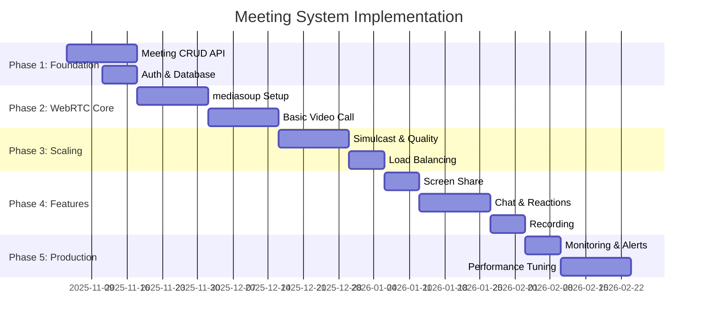

# 🎪 KCS Meeting System - Documentation Hub

> **Production-Grade MS Teams-Style Video Conferencing Platform**  
> WebRTC • mediasoup SFU • Socket.IO • Real-time Collaboration

[](https://github.com/omyratechnologies/KCS-Backend)
[](https://github.com/omyratechnologies/KCS-Backend)
[](./MEETING_SYSTEM_ARCHITECTURE.md)

---

## 📚 Documentation Index

### 🏗️ Architecture & Design
**[MEETING_SYSTEM_ARCHITECTURE.md](./MEETING_SYSTEM_ARCHITECTURE.md)**  
Complete system architecture, components, flows, and design decisions

- Architecture diagrams and component breakdown
- Complete WebSocket event catalog (40+ events)
- 6 detailed user flows with step-by-step guides
- Scaling strategies and capacity planning
- Security, compliance, and monitoring
- 4-6 month implementation roadmap

**Best for:** System architects, technical leads, new team members

---

### 💻 Implementation & Code
**[MEETING_IMPLEMENTATION_GUIDE.md](./MEETING_IMPLEMENTATION_GUIDE.md)**  
Clean code practices, patterns, and implementation guidelines

- Service layer design patterns
- WebSocket event handling
- WebRTC service optimization
- Error handling strategies
- Performance patterns
- Testing strategies
- Security implementations

**Best for:** Backend developers, code reviewers

---

### 🔧 Operations & Troubleshooting
**[MEETING_TROUBLESHOOTING_GUIDE.md](./MEETING_TROUBLESHOOTING_GUIDE.md)**  
Diagnostic procedures, common issues, and optimization techniques

- 8 common issues with solutions
- Performance troubleshooting
- WebRTC debugging
- Network issue resolution
- Monitoring & alerting setup
- Optimization checklists

**Best for:** DevOps, SRE, on-call engineers

---

### ⚡ Quick Reference
**[QUICK_REFERENCE.md](./QUICK_REFERENCE.md)**  
Cheat sheet for common commands, APIs, and debugging

- Quick start commands
- API endpoint reference
- Socket.IO event cheatsheet
- Debugging commands
- Common fixes
- Emergency procedures

**Best for:** Daily development, troubleshooting, on-call reference

---

### 📋 Summary & Index
**[proper-style of meeting.md](./proper-style%20of%20meeting.md)**  
Navigation hub and documentation overview

**[DOCUMENTATION_REVAMP_SUMMARY.md](./DOCUMENTATION_REVAMP_SUMMARY.md)**  
Summary of documentation revamp and improvements

---

## 🚀 Quick Start

### For Developers
```bash
# 1. Read architecture overview
open docs/meetings/MEETING_SYSTEM_ARCHITECTURE.md

# 2. Review implementation patterns
open docs/meetings/MEETING_IMPLEMENTATION_GUIDE.md

# 3. Keep quick reference handy
open docs/meetings/QUICK_REFERENCE.md
```

### For Operations
```bash
# 1. Set up monitoring (see architecture doc)
# 2. Configure alerts (see troubleshooting guide)
# 3. Test health checks
curl https://api.example.com/api/health/webrtc
```

---

## 🎯 System Capabilities

### Core Features
✅ **Real-Time Video Conferencing** - Up to 10,000 participants  
✅ **HD Quality** - Adaptive bitrate with simulcast  
✅ **Screen Sharing** - High-quality with optimization  
✅ **Live Streaming** - Broadcast to CDN with HLS/DASH  
✅ **In-Meeting Chat** - With reactions and typing indicators  
✅ **Recording** - Cloud recording with MP4 export  
✅ **Advanced Controls** - Host controls, mute, remove, roles  

### Technical Excellence
✅ **Sub-500ms Latency** - Real-time communication  
✅ **Horizontal Scaling** - Multi-worker architecture  
✅ **99%+ Uptime** - Robust error handling and recovery  
✅ **Secure** - TLS, DTLS/SRTP, JWT auth, RBAC  
✅ **Observable** - Comprehensive metrics and logging  

---

## 📊 Architecture Overview

```
┌──────────────────────────────────────────────────────────┐
│                    CLIENT LAYER                           │
│          Web • Mobile • Desktop Applications              │
└────────────┬─────────────────────────────────────────────┘
             │ WebSocket (Signaling) + WebRTC (Media)
┌────────────┴─────────────────────────────────────────────┐
│           SIGNALING SERVER LAYER                          │
│        Node.js + Socket.IO + Hono.js                      │
│  • REST API                • Authentication               │
│  • Real-time signaling     • Authorization                │
└────────────┬─────────────────────────────────────────────┘
             │ Internal API
┌────────────┴─────────────────────────────────────────────┐
│              SFU MEDIA LAYER                              │
│            mediasoup Workers                              │
│  • Selective Forwarding    • Simulcast                    │
│  • Adaptive Quality        • Load Balancing               │
└───────────────────────────────────────────────────────────┘
```

See [MEETING_SYSTEM_ARCHITECTURE.md](./MEETING_SYSTEM_ARCHITECTURE.md) for complete diagrams.

---

## 🔌 Socket.IO Events

### Essential Events

| Client → Server | Server → Client | Purpose |
|-----------------|-----------------|---------|
| `room:join` | `room:joined` | Join meeting |
| `room:leave` | `participant:left` | Leave meeting |
| `media:toggle` | `media:updated` | Toggle mic/camera |
| `screen:start` | `screen:started` | Screen sharing |
| `chat:send` | `chat:message` | In-meeting chat |

See [MEETING_SYSTEM_ARCHITECTURE.md](./MEETING_SYSTEM_ARCHITECTURE.md#websocket-events-socketio) for complete event catalog (40+ events).

---

## 📈 Performance Targets

| Metric | Target | Acceptable | Action Required |
|--------|--------|------------|-----------------|
| Latency | <100ms | <300ms | >500ms |
| Jitter | <30ms | <50ms | >100ms |
| Packet Loss | <1% | <3% | >5% |
| CPU Usage | <60% | <80% | >90% |
| Join Success | >99% | >95% | <95% |

---

## 🛠️ Tech Stack

| Component | Technology |
|-----------|-----------|
| **Backend** | Node.js + Hono.js |
| **WebSocket** | Socket.IO v4 |
| **SFU** | mediasoup v3 |
| **Database** | Couchbase / MongoDB |
| **Cache** | Redis |
| **TURN/STUN** | coturn |
| **Monitoring** | Prometheus + Grafana |

---

## 🗓️ Implementation Roadmap



**Total Timeline:** 4-6 months

---

## 🔒 Security Highlights

✅ **Authentication** - JWT with refresh tokens  
✅ **Authorization** - Role-based access control (RBAC)  
✅ **Encryption** - TLS (signaling) + DTLS/SRTP (media)  
✅ **Input Validation** - Zod schema validation  
✅ **Rate Limiting** - Prevent abuse and DDoS  
✅ **Audit Logging** - Track sensitive operations  

---

## 📞 Support & Resources

### Internal
- **Slack:** `#kcs-meetings-dev`
- **Issue Tracker:** JIRA KCS-MEET
- **On-Call:** PagerDuty rotation

### External
- [mediasoup Documentation](https://mediasoup.org/documentation/v3/)
- [Socket.IO Documentation](https://socket.io/docs/v4/)
- [WebRTC MDN Guide](https://developer.mozilla.org/en-US/docs/Web/API/WebRTC_API)

---

## 🎯 Quick Links

| Link | Description |
|------|-------------|
| [Architecture](./MEETING_SYSTEM_ARCHITECTURE.md) | Complete system design |
| [Implementation](./MEETING_IMPLEMENTATION_GUIDE.md) | Code patterns & practices |
| [Troubleshooting](./MEETING_TROUBLESHOOTING_GUIDE.md) | Debug & optimize |
| [Quick Reference](./QUICK_REFERENCE.md) | Cheat sheet |
| [API Docs](https://api.example.com/docs) | OpenAPI spec |
| [Monitoring](https://grafana.example.com/meetings) | Dashboards |

---

## 📊 Documentation Stats

- **Total Documentation:** 6,500+ lines
- **Code Examples:** 50+
- **Events Documented:** 40+
- **User Flows:** 6 detailed scenarios
- **Troubleshooting Scenarios:** 8 with solutions
- **Architecture Diagrams:** 3 major diagrams

---

## 🎓 Learning Path

### Week 1: Understanding
1. Read [MEETING_SYSTEM_ARCHITECTURE.md](./MEETING_SYSTEM_ARCHITECTURE.md)
2. Study WebRTC and mediasoup basics
3. Review current codebase structure

### Week 2: Hands-On
1. Set up development environment
2. Follow [MEETING_IMPLEMENTATION_GUIDE.md](./MEETING_IMPLEMENTATION_GUIDE.md)
3. Build a simple meeting feature

### Week 3: Advanced
1. Implement simulcast and quality control
2. Add monitoring and metrics
3. Performance optimization

### Week 4: Production
1. Review [MEETING_TROUBLESHOOTING_GUIDE.md](./MEETING_TROUBLESHOOTING_GUIDE.md)
2. Set up alerting
3. On-call readiness training

---

## 🏆 Best Practices Enforced

✅ **Code Quality** - SOLID principles, clean code patterns  
✅ **Performance** - Caching, parallelism, optimization  
✅ **Security** - Defense in depth, least privilege  
✅ **Reliability** - Error handling, graceful degradation  
✅ **Observability** - Logging, metrics, tracing  
✅ **Documentation** - Clear, actionable, maintained  

---

## 🚀 Getting Started Checklist

### For New Developers
- [ ] Read architecture overview
- [ ] Set up development environment
- [ ] Run local meeting system
- [ ] Review code patterns in implementation guide
- [ ] Build first feature (e.g., chat)

### For DevOps
- [ ] Review scaling strategy
- [ ] Set up monitoring dashboards
- [ ] Configure alerts
- [ ] Test backup/recovery procedures
- [ ] Review emergency runbook

### For Product/Management
- [ ] Review feature set and capabilities
- [ ] Understand implementation timeline
- [ ] Review compliance and security
- [ ] Plan phased rollout

---

## 🌟 What's Next?

### Q1 2026 Roadmap
- Breakout rooms
- Virtual backgrounds
- Live transcription
- Whiteboard collaboration
- Advanced analytics

### Continuous Improvement
- Performance optimization
- Security hardening
- Feature enhancements
- Documentation updates

---

## 📝 Contributing

When updating documentation:

1. Update version number and date
2. Follow existing structure and style
3. Add code examples where applicable
4. Update this README index if adding new docs
5. Get peer review before merging

---

## 📜 Version History

- **v2.0** (Nov 2025) - Complete documentation revamp
- **v1.0** (Oct 2025) - Initial implementation

---

## 💡 Pro Tips

💡 **Bookmark** [QUICK_REFERENCE.md](./QUICK_REFERENCE.md) for daily use  
💡 **Print** the quick reference and keep on desk  
💡 **Review** troubleshooting guide during on-call shifts  
💡 **Update** docs when you solve a new issue  
💡 **Share** knowledge with team in Slack  

---

<div align="center">

**Built with 💙 by the KCS Development Team**

[Report Issue](https://github.com/omyratechnologies/KCS-Backend/issues) • [Request Feature](https://github.com/omyratechnologies/KCS-Backend/issues) • [View Roadmap](./MEETING_SYSTEM_ARCHITECTURE.md#implementation-checklist)

</div>
