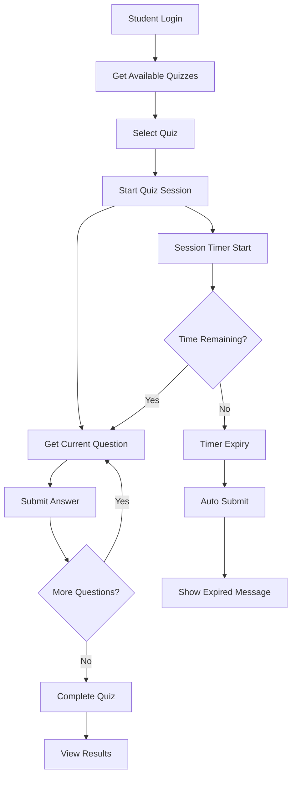

# Complete Quiz Flow Guide

## Real-World Quiz API Implementation

Based on successful API testing against the production environment `https://dev-api.letscatchup-kcs.com`, this document provides a complete guide for implementing quiz functionality.

## 🎯 Quiz Flow Overview



## 🔄 Complete API Flow

### 1. **Quiz Session Lifecycle**

#### A. Start Quiz Session
```http
POST https://dev-api.letscatchup-kcs.com/api/class-quiz/session/{class_id}/{quiz_id}/start
Authorization: {jwt_token}
```

**Example Response:**
```json
{
    "success": true,
    "message": "Quiz session started successfully",
    "data": {
        "session": {
            "session_token": "d9905ffe56ca42c17473da83d8adfe5d1318b80f046ce731ae73a30f932c3e17",
            "status": "in_progress",
            "started_at": "2025-06-28T11:37:21.125Z",
            "expires_at": "2025-06-28T12:37:21.125Z",
            "time_limit_minutes": 60,
            "answers_count": 0,
            "total_questions": 1,
            "remaining_time_seconds": 3600
        },
        "quiz": {
            "quiz_name": "test",
            "quiz_description": "test-quiz",
            "quiz_meta_data": {
                "time_limit_minutes": 60,
                "shuffle_questions": true,
                "max_attempts": 3,
                "passing_score": 60,
                "total_points": 100
            }
        },
        "current_question": {
            "id": "0a001509-31b3-4072-82e6-e3d8ba0a5097",
            "question_text": "2+2",
            "question_type": "multiple_choice",
            "options": ["1", "3", "4"],
            "meta_data": {
                "difficulty": "medium",
                "points": 5
            }
        },
        "time_remaining_seconds": 3600
    }
}
```

#### B. Submit Answer
```http
POST https://dev-api.letscatchup-kcs.com/api/class-quiz/session/{session_token}/answer
Authorization: {jwt_token}
Content-Type: application/json

{
    "question_id": "0a001509-31b3-4072-82e6-e3d8ba0a5097",
    "answer": "4"
}
```

**Key Features:**
- ✅ **Auto-save**: Answers are immediately saved
- ✅ **Update support**: Can update answers before completion
- ✅ **Time tracking**: Remaining time is updated in real-time
- ✅ **Session validation**: Checks for expired sessions

#### C. Complete Quiz
```http
POST https://dev-api.letscatchup-kcs.com/api/class-quiz/session/{session_token}/complete
Authorization: {jwt_token}
```

**Example Response:**
```json
{
    "success": true,
    "message": "Quiz completed successfully",
    "data": {
        "score": 1,
        "total_questions": 1,
        "percentage": 100,
        "correct_answers": 1,
        "incorrect_answers": 0,
        "time_taken_seconds": 1706,
        "submission": {
            "id": "1d533854-18b6-4b2f-8253-8c7d0a06efc0",
            "submission_date": "2025-06-28T12:05:47.671Z",
            "score": 1,
            "feedback": "Quiz submitted successfully"
        }
    }
}
```

### 2. **Administrative Endpoints**

#### Get Quiz Statistics *(Now Available!)*
```http
GET https://dev-api.letscatchup-kcs.com/api/class-quiz/{class_id}/{quiz_id}/statistics
Authorization: {jwt_token}
```

**Response:**
```json
{
    "success": true,
    "data": {
        "total_attempts": 15,
        "average_score": 85.6,
        "highest_score": 100,
        "lowest_score": 45,
        "completion_rate": 87.5,
        "submissions": [...]
    }
}
```

## 💻 Frontend Implementation

### JavaScript/TypeScript Example

```javascript
class QuizManager {
    constructor(apiBase, authToken) {
        this.apiBase = apiBase;
        this.authToken = authToken;
        this.sessionToken = null;
        this.timer = null;
    }

    async startQuiz(classId, quizId) {
        try {
            const response = await fetch(`${this.apiBase}/class-quiz/session/${classId}/${quizId}/start`, {
                method: 'POST',
                headers: {
                    'Authorization': this.authToken,
                    'Content-Type': 'application/json'
                }
            });

            const data = await response.json();
            
            if (data.success) {
                this.sessionToken = data.data.session.session_token;
                this.startTimer(data.data.time_remaining_seconds);
                return data.data;
            }
            
            throw new Error(data.message);
        } catch (error) {
            console.error('Failed to start quiz:', error);
            throw error;
        }
    }

    async submitAnswer(questionId, answer) {
        try {
            const response = await fetch(`${this.apiBase}/class-quiz/session/${this.sessionToken}/answer`, {
                method: 'POST',
                headers: {
                    'Authorization': this.authToken,
                    'Content-Type': 'application/json'
                },
                body: JSON.stringify({
                    question_id: questionId,
                    answer: answer
                })
            });

            const data = await response.json();
            
            if (!data.success) {
                if (data.message.includes('expired')) {
                    this.handleSessionExpired();
                    return;
                }
                throw new Error(data.message);
            }

            // Update UI with new session data
            this.updateProgress(data.data);
            return data.data;
        } catch (error) {
            console.error('Failed to submit answer:', error);
            throw error;
        }
    }

    async completeQuiz() {
        try {
            const response = await fetch(`${this.apiBase}/class-quiz/session/${this.sessionToken}/complete`, {
                method: 'POST',
                headers: {
                    'Authorization': this.authToken,
                    'Content-Type': 'application/json'
                }
            });

            const data = await response.json();
            
            if (data.success) {
                this.stopTimer();
                this.showResults(data.data);
                return data.data;
            }
            
            throw new Error(data.message);
        } catch (error) {
            console.error('Failed to complete quiz:', error);
            throw error;
        }
    }

    startTimer(seconds) {
        this.stopTimer(); // Clear any existing timer
        
        this.timer = setInterval(() => {
            seconds--;
            this.updateTimerDisplay(seconds);
            
            if (seconds <= 0) {
                this.handleTimeout();
            }
            
            // Warning notifications
            if (seconds === 300) { // 5 minutes
                this.showWarning('5 minutes remaining!');
            } else if (seconds === 60) { // 1 minute
                this.showWarning('1 minute remaining!');
            }
        }, 1000);
    }

    stopTimer() {
        if (this.timer) {
            clearInterval(this.timer);
            this.timer = null;
        }
    }

    handleTimeout() {
        this.stopTimer();
        alert('Time has expired! Your answers have been automatically saved and submitted.');
        // The backend will auto-submit the quiz
        window.location.href = '/quiz-results';
    }

    handleSessionExpired() {
        this.stopTimer();
        alert('Quiz session has expired and has been auto-submitted. Your answers have been saved.');
        window.location.href = '/quiz-results';
    }

    updateTimerDisplay(seconds) {
        const minutes = Math.floor(seconds / 60);
        const remainingSeconds = seconds % 60;
        const display = `${minutes}:${remainingSeconds.toString().padStart(2, '0')}`;
        
        document.getElementById('timer').textContent = display;
        
        // Visual warnings
        if (seconds <= 300) {
            document.getElementById('timer').className = 'timer warning';
        }
        if (seconds <= 60) {
            document.getElementById('timer').className = 'timer critical';
        }
    }

    updateProgress(sessionData) {
        const progress = (sessionData.session.answers_count / sessionData.session.total_questions) * 100;
        document.getElementById('progress').style.width = `${progress}%`;
        document.getElementById('progress-text').textContent = 
            `${sessionData.session.answers_count}/${sessionData.session.total_questions} questions answered`;
    }

    showResults(results) {
        const resultHTML = `
            <div class="quiz-results">
                <h2>Quiz Completed!</h2>
                <div class="score">Score: ${results.score}/${results.total_questions}</div>
                <div class="percentage">Percentage: ${results.percentage}%</div>
                <div class="time-taken">Time Taken: ${Math.floor(results.time_taken_seconds / 60)} minutes</div>
                <div class="feedback">${results.submission.feedback}</div>
            </div>
        `;
        document.getElementById('quiz-container').innerHTML = resultHTML;
    }

    showWarning(message) {
        // Show non-blocking notification
        const notification = document.createElement('div');
        notification.className = 'time-warning';
        notification.textContent = message;
        document.body.appendChild(notification);
        
        setTimeout(() => {
            notification.remove();
        }, 3000);
    }
}

// Usage Example
const quizManager = new QuizManager(
    'https://dev-api.letscatchup-kcs.com/api',
    'eyJhbGciOiJIUzUxMiIsInR5cCI6IkpXVCJ9...'
);

// Start quiz
quizManager.startQuiz('29562c3d-9ea8-420f-b3dc-b9dc8cab623d', '47452868-0599-4f05-ace4-8e1a78091218')
    .then(quizData => {
        console.log('Quiz started:', quizData);
        // Initialize UI with quiz data
    })
    .catch(error => {
        console.error('Error starting quiz:', error);
    });
```

## 🎨 React Component Example

```jsx
import React, { useState, useEffect, useCallback } from 'react';

const QuizComponent = ({ classId, quizId, authToken }) => {
    const [quizData, setQuizData] = useState(null);
    const [sessionToken, setSessionToken] = useState(null);
    const [timeRemaining, setTimeRemaining] = useState(0);
    const [currentAnswer, setCurrentAnswer] = useState('');
    const [isSubmitting, setIsSubmitting] = useState(false);
    const [results, setResults] = useState(null);

    const quizManager = new QuizManager('https://dev-api.letscatchup-kcs.com/api', authToken);

    useEffect(() => {
        startQuiz();
    }, []);

    useEffect(() => {
        if (timeRemaining > 0) {
            const timer = setTimeout(() => {
                setTimeRemaining(prev => prev - 1);
            }, 1000);
            return () => clearTimeout(timer);
        } else if (timeRemaining === 0 && sessionToken) {
            handleTimeout();
        }
    }, [timeRemaining, sessionToken]);

    const startQuiz = async () => {
        try {
            const data = await quizManager.startQuiz(classId, quizId);
            setQuizData(data);
            setSessionToken(data.session.session_token);
            setTimeRemaining(data.time_remaining_seconds);
        } catch (error) {
            console.error('Failed to start quiz:', error);
        }
    };

    const submitAnswer = async () => {
        if (!currentAnswer || isSubmitting) return;
        
        setIsSubmitting(true);
        try {
            await quizManager.submitAnswer(
                quizData.current_question.id,
                currentAnswer
            );
            setCurrentAnswer('');
        } catch (error) {
            console.error('Failed to submit answer:', error);
        } finally {
            setIsSubmitting(false);
        }
    };

    const completeQuiz = async () => {
        try {
            const result = await quizManager.completeQuiz();
            setResults(result);
        } catch (error) {
            console.error('Failed to complete quiz:', error);
        }
    };

    const handleTimeout = () => {
        alert('Time has expired! Your answers have been automatically submitted.');
        // Quiz will be auto-submitted by backend
    };

    const formatTime = (seconds) => {
        const minutes = Math.floor(seconds / 60);
        const remainingSeconds = seconds % 60;
        return `${minutes}:${remainingSeconds.toString().padStart(2, '0')}`;
    };

    if (results) {
        return (
            <div className="quiz-results">
                <h2>Quiz Completed!</h2>
                <div className="score">Score: {results.score}/{results.total_questions}</div>
                <div className="percentage">Percentage: {results.percentage}%</div>
                <div className="time-taken">Time Taken: {Math.floor(results.time_taken_seconds / 60)} minutes</div>
            </div>
        );
    }

    if (!quizData) {
        return <div className="loading">Loading quiz...</div>;
    }

    return (
        <div className="quiz-container">
            <div className="quiz-header">
                <h1>{quizData.quiz.quiz_name}</h1>
                <div className={`timer ${timeRemaining <= 300 ? 'warning' : ''}`}>
                    Time Remaining: {formatTime(timeRemaining)}
                </div>
            </div>

            <div className="question-section">
                <h3>{quizData.current_question.question_text}</h3>
                <div className="options">
                    {quizData.current_question.options.map((option, index) => (
                        <label key={index} className="option">
                            <input
                                type="radio"
                                name="answer"
                                value={option}
                                checked={currentAnswer === option}
                                onChange={(e) => setCurrentAnswer(e.target.value)}
                            />
                            {option}
                        </label>
                    ))}
                </div>
            </div>

            <div className="quiz-actions">
                <button 
                    onClick={submitAnswer} 
                    disabled={!currentAnswer || isSubmitting}
                    className="submit-answer-btn"
                >
                    {isSubmitting ? 'Submitting...' : 'Submit Answer'}
                </button>
                
                <button onClick={completeQuiz} className="complete-quiz-btn">
                    Complete Quiz
                </button>
            </div>

            <div className="progress">
                Progress: {quizData.session.answers_count}/{quizData.session.total_questions}
            </div>
        </div>
    );
};

export default QuizComponent;
```

## 🔧 Error Handling Best Practices

### 1. **Session Expiry Handling**
```javascript
const handleApiCall = async (apiCall) => {
    try {
        return await apiCall();
    } catch (error) {
        if (error.message.includes('expired')) {
            showSessionExpiredModal();
            redirectToResults();
        } else if (error.message.includes('invalid session')) {
            restartQuiz();
        } else {
            showErrorMessage(error.message);
        }
        throw error;
    }
};
```

### 2. **Network Failure Recovery**
```javascript
const retryApiCall = async (apiCall, maxRetries = 3) => {
    for (let i = 0; i < maxRetries; i++) {
        try {
            return await apiCall();
        } catch (error) {
            if (i === maxRetries - 1) throw error;
            await new Promise(resolve => setTimeout(resolve, 1000 * (i + 1)));
        }
    }
};
```

## 📊 Performance Optimizations

### 1. **Answer Debouncing**
```javascript
const debouncedSubmitAnswer = debounce(async (questionId, answer) => {
    await quizManager.submitAnswer(questionId, answer);
}, 500);
```

### 2. **Optimistic UI Updates**
```javascript
const submitAnswerOptimistic = (answer) => {
    // Update UI immediately
    setCurrentAnswer(answer);
    updateAnswerCount(prevCount => prevCount + 1);
    
    // Then sync with server
    submitAnswer(questionId, answer).catch(() => {
        // Revert on failure
        setCurrentAnswer('');
        updateAnswerCount(prevCount => prevCount - 1);
    });
};
```

## 🛡️ Security Considerations

1. **Always validate JWT tokens** server-side
2. **Never expose correct answers** in frontend code
3. **Implement rate limiting** for quiz attempts
4. **Use HTTPS** for all API communications
5. **Validate session tokens** on every request

## 📈 Monitoring & Analytics

### Track Key Metrics:
- Quiz completion rates
- Average time per question
- Session abandonment points
- Timeout frequencies
- Error rates by endpoint

### Example Analytics Implementation:
```javascript
const analytics = {
    trackQuizStart: (quizId) => {
        gtag('event', 'quiz_start', { quiz_id: quizId });
    },
    trackAnswerSubmit: (questionId, timeTaken) => {
        gtag('event', 'answer_submit', { 
            question_id: questionId, 
            time_taken: timeTaken 
        });
    },
    trackQuizComplete: (score, percentage) => {
        gtag('event', 'quiz_complete', { 
            score: score, 
            percentage: percentage 
        });
    }
};
```

## 🎯 Production Deployment

### Environment Configuration:
```javascript
const config = {
    development: {
        apiBase: 'http://localhost:4500/api',
        enableLogging: true
    },
    production: {
        apiBase: 'https://dev-api.letscatchup-kcs.com/api',
        enableLogging: false
    }
};
```

This complete guide provides everything needed to implement a robust, production-ready quiz system using the validated Class Quiz APIs.
